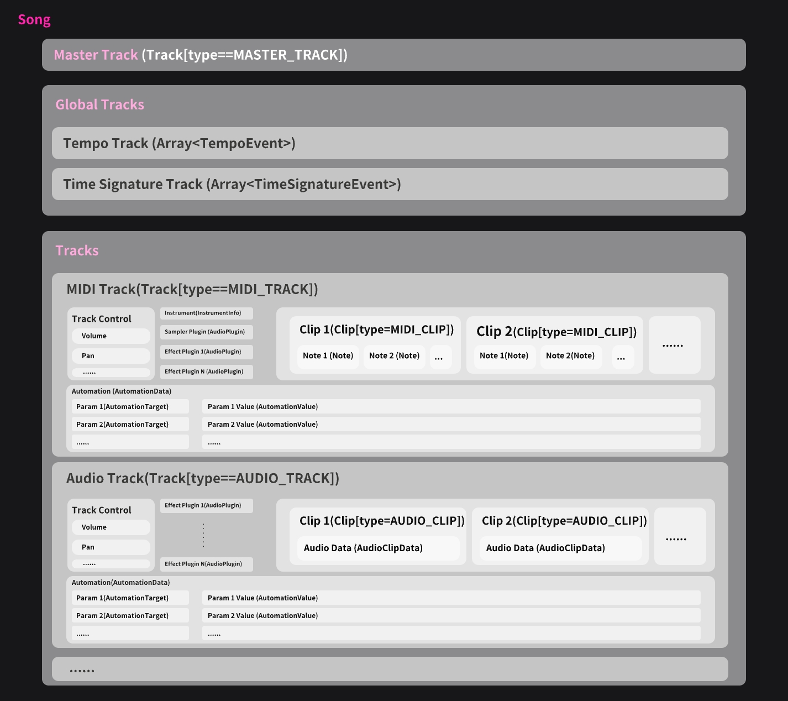

# Data Models

This section is recommended to be read together with the corresponding [source code](https://github.com/tuneflow/tuneflow/tree/master/src/models). The main data types are as follows:

## Song (`class Song`)

Song `class Song`, file [src/models/song.ts](https://github.com/tuneflow/tuneflow/blob/master/src/models/song.ts). It contains all the data of the entire piece of music, mainly including:

**Global Data**

- Resolution / PPQ
  - PPQ(Pulses-per-Quater Note) refers to how many ticks are there in a quater note/
- Tempo Track (`Array<TempoEvent>`)
  - Contains all the tempo changes.
- Time Signature Track (`Array<TimeSignatureEvent>`)
  - Contains all the time signature changes.

**Master Track（`masterTrack: Track`）**

Controlling the overall volume, pan, effects, etc.

**Tracks（`Array<Track>`)**

Contains all other types of tracks tracks.

## Track (`class Track`)

File [src/models/track.ts](https://github.com/tuneflow/tuneflow/blob/master/src/models/track.ts). Tracks come in different types, including MIDI tracks, audio tracks, and master tracks, which are currently supported.

**Common track data** All tracks that produce sound (MIDI, Audio, and Master) contain the following data:

- Volume (`volume`): The position of the volume fader, ranging 0-1.
- Pan (`pan`): Represents how much of the audio from the track is sent to the left or right channels, with a value between -64 (all left) and 63 (all right). 0 means balanced.
- Muted (`muted`): Indicates whether the track is muted or not.
- Solo（`solo`）: Indicating whether only this track should be played.
- Automation(`automation`): Contains all automation parameters and their corresponding value sequences.
- Audio Plugin (`audioPlugins`): Responsible for processing audio effects using VST/AU plugins.
- Clip (`clips`)：Both MIDI and audio tracks can contain clips, which can carry a segment of notes or audio.

**MIDI Track**

MIDI tracks primarily carry note data and their `type` is `TrackType.MIDI_TRACK`.

They contain instrument information (`instrument: InstrumentInfo`), sampler plugin data (`samplerPlugin: AudioPlugin`), and MIDI clips (`clips: Array<Clip[type==MIDI_CLIP]`).

When the user plays back using the Minimal playback engine, the DAW uses the instrument specified in `instrument` to convert the note data into audio;

when using the `VST` playback engine, the DAW uses the VST/AU plugin specified in `samplerPlugin` to do the conversion.

MIDI tracks are stored in the `tracks` property of a `Song` and are responsible for handling only clips of type `ClipType.MIDI_CLIP.`

**Audio Track**

Audio tracks primarily carry audio files, and their `type` is `TrackType.AUDIO_TRACK`.

They are stored in the `tracks` of a `Song`, and are only responsible for processing clips of type `ClipType.AUDIO_CLIP`.

**Master Track**

This track does not contain any clips. Its main function is to provide global control over various parameters such as volume, pan, or effects. It can also have global effects plugins. It is not part of the `tracks` in `Song`, but is a separate property called `masterTrack`. Its type is `TrackType.MASTER_TRACK`.

<!-- prettier-ignore-start -->
::: tip
Conceptually tempo and time signature are referred to as tracks, but as mentioned earlier, they are only stored as arrays of their respective data in the `Song` and are not part of the `Track` type.
:::
<!-- prettier-ignore-end -->

## Clip (`class Clip`)

File [src/models/clip.ts](https://github.com/tuneflow/tuneflow/blob/master/src/models/clip.ts). Clips exist in the `clips` list of a `Track` and are the actual containers of notes and audio. Users can adjust the start and end positions of clips and also move them between different tracks.

**MIDI Clip**

The type of a MIDI clip is `ClipType.MIDI_CLIP`, and it only works in MIDI tracks. It mainly contains a `notes: Array<Note>` list.

**Audio Clip**

The `type` of an audio clip is `ClipType.AUDIO_CLIP`, and it is only valid in an audio track. It mainly includes audio data that points to an audio file: `audioClipData: AudioClipData`.

## Audio Plugin (`class AudioPlugin`)

File [src/models/audio_plugin.ts](https://github.com/tuneflow/tuneflow/blob/master/src/models/audio_plugin.ts). An audio plugin refers to traditional VST/AU plugins used for audio processing. They can be either instrument plugins (Synth/Sampler) used to convert MIDI notes into audio or effects plugins used to add various effects to audio.

Both MIDI and audio tracks contain a list of `audioPlugins: Array<AudioPlugin>` to store information about audio effects plugins. MIDI tracks also have a `samplerPlugin: AudioPlugin` property to store information about the sound source plugin.

## Automation (`class AutomationData`)

File [src/models/automation.ts](https://github.com/tuneflow/tuneflow/blob/master/src/models/automation.ts). The charm of music largely comes from its variations. For example, in some sections, we may want a certain instrument to take the lead, while in others, we may want that instrument to become softer. In this case, we can automate the track's volume parameter so that it changes over time. This process is called automation. Because the data points we add can be connected to form a changing curve, we usually call them envelopes.

Automation is stored in the `automation: AutomationData` property of the `Track`. `AutomationData` consists of two parts: automation target (`AutomationTarget`) and automation values (`AutomationValue`). The former is stored in `AutomationData` as a list of `AutomationTarget` in the form of `targets: AutomationTarget[]`, which lists all the properties in the track that have automation information. The latter is stored in `AutomationData` as an object in the form of `targetValues: { [tfAutomationTargetId: string]: AutomationValue}`, which contains the data for each automation point corresponding to each AutomationTarget.

Continue reading: [How to Create Your First Plugin](./create-your-first-plugin.md)
