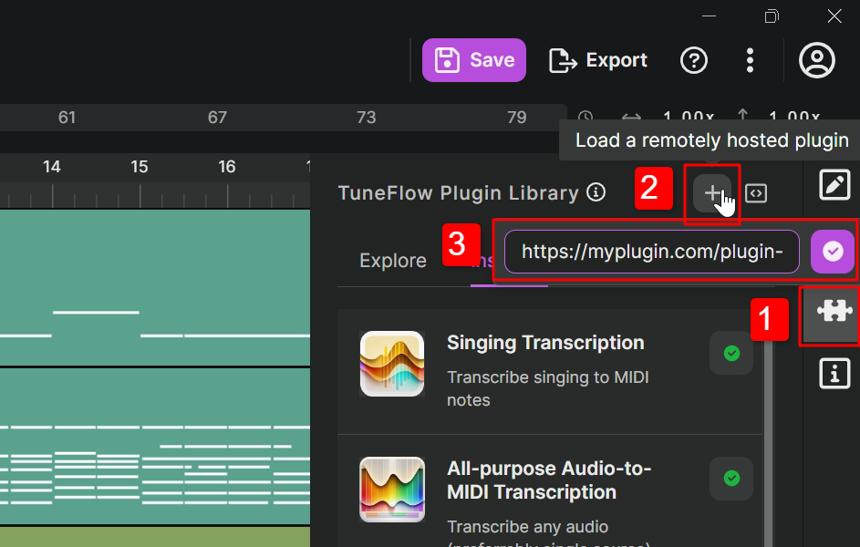

# Deploy Your Plugins

## Deployment preparation

### Clean up bundle.json

- First, check that the plugin name, developer name, and plugin description in your bundle.json are complete. A good description can help users get started more easily.
- Clear the `isInDevelopment` fields in bundle.json. This parameter is used for plugins under development to prevent them from being installed by other users. When you plan to deploy the plugin, you should remove this field, otherwise your users will encounter errors during installation.

### Read and write files using `BytesIO` or `tempfile`

When plugins are running on the server side, they may receive a large number of user requests. If you use regular file operations to write to a regular directory, it will cause a high disk load and high latency, and a large number of files will also occupy your disk space. Therefore, we strongly recommend that you use `BytesIO` or `tempfile` for all file IO operations.

## Optimize plugin performance

Before deploying your plugin, you need to fine-tune its performance. This is not only because users are very sensitive to latency, but also because unoptimized plugins may unnecessarily burden the server during long-term operation.

### Optimize modelloading

If your model is large, reading the model every time a request is made will obviously result in a large number of disk reads and high latency. If your server has large enough RAM / GPU memory, you can load the model into a global variable and use the global model variable in the `def run` method.

<!-- prettier-ignore-start -->
::: tip
tuneflow-devkit-py's `Runner` uses a multithreaded model by default, which will not cause additional model memory usage. If your code uses multiple processes, each process will store a separate copy of the model. In this case, you may need to consider whether the server's memory is sufficient.
:::

<!-- prettier-ignore-end -->

### Optimize audio data transfer

When your parameter is an audio parameter, that is, using injection type `InjectFrom.ClipAudioData`, you may not need the complete audio, nor the original sound quality. For example, if you are creating an audio to MIDI transcription plugin, you only need to select the visible part of the clip, and the audio may only need to be sampled at 22kHz. In this case, providing a [convert](https://github.com/tuneflow/tuneflow-py/blob/main/src/tuneflow_py/descriptors/param.py#L16) configuration can significantly reduce network latency.

```python
...
    "injectFrom": {
        "type": InjectSource.ClipAudioData.value,
        "options": {
            "clips": "selectedAudioClips",
            "convert": {
                "toFormat": "ogg",
                "options": {
                    "sampleRate": 44100
                }
            }
        }
    }
...
```

## Write a plugin server with `Runner`

[Runner](https://github.com/tuneflow/tuneflow-devkit-py/blob/main/src/tuneflow_devkit/runner.py) is a TuneFlow plugin server based on [FastAPI](https://fastapi.tiangolo.com/). Basically, you can simply replace `Debugger` with `Runner` and add some simple configurations to build your plugin server. Usually we name this server file `app.py`, and a simple example is as follows:

```python
# app.py
from plugin import BasicPitchTranscribe
from tuneflow_devkit import Runner
from pathlib import Path
import uvicorn

app = Runner(plugin_class_list=[BasicPitchTranscribe], bundle_file_path=str(Path(__file__).parent.joinpath('bundle.json').absolute())).start(path_prefix='/plugin-service/basic_pitch')

if __name__ == "__main__":
    uvicorn.run(app, host="0.0.0.0", port=8000)

```

If you need to support more features on your server, such as authentication or cross-origin (CORS) verification, you can add `config` or directly manipulate the returned app instance.

```python
# app.py
...

app = Runner(...).start(...)

@app.middleware("http")
async def my_app(request: Request, call_next):
    response = await call_next(request)
    # Do something with the response
    ...
    return response
```

## Running your plugin server

By default, `Runner` uses [uvicorn](https://www.uvicorn.org/) to run the plugin server. It is a lightweight Python ASGI server that supports common Python asynchronous programming patterns. For example, in the `app.py` example above, we can simply start the server by:

```bash
python app.py
```

If you have higher requirements for load balancing, you can also add a reverse proxy server such as [Nginx](https://www.nginx.com/) on top of this.

## Installing your plugin in TuneFlow

Once the server is up and running, anyone can load your plugin into the plugin library by clicking the "Load a remotely hosted plugin" button in the TuneFlow plugin library panel. The plugin address should be:

```
https://<your_server_host_name>/<plugin_path_prefix>
```

Whereas `<plugin_path_prefix>` is the `path_prefix` you provided in `app.py`.



## Publishing to TuneFlow plugin library

Want your plugin to be listed in TuneFlow's plugin library? You can send a Pull Request to our [Demo Repository](https://github.com/tuneflow/tuneflow-py-demos) adding your plugin repository as a submodule. Or you can simply [shoot us an email](mailto:contact@info.tuneflow.com) and provide your plugin information to us.
