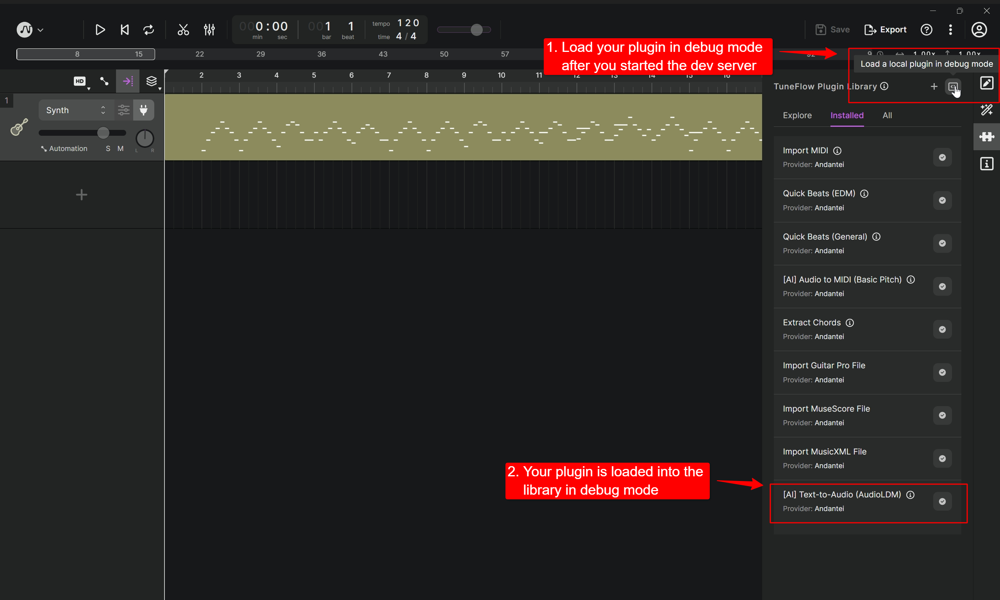

# Run and Debug Your Plugin Locally

To develop a TuneFlow plugin locally, we need to start a local debug server that simulates a production server but talks to TuneFlow directly. To do that, we need to first install `tuneflow-devkit-py`.

```bash
pip install tuneflow-devkit-py
```

<!-- prettier-ignore-start -->
::: tip
In most cases you will just need to install `tuneflow-devkit-py` to debug and deploy your plugins. But if you need features that are only supported in a newer version of `tuneflow-py`, you can add `tuneflow-py` manually into your `requirements.txt`. Note that you may need to make sure the version of `tuneflow-py` is compatible with the `tuneflow-devkit-py` you are using. To do that, check the `requirements.txt` in `tuneflow-devkit-py` and see if its `tuneflow-py` has the same minor version as your `tuneflow-py`.
:::
<!-- prettier-ignore-end -->

## Run a Python TuneFlow Plugin With `tuneflow-devkit-py`

To run a plugin locally, we need to create a debug server that hosts the plugin and talks to TuneFlow. Let's call it `debug.py`, which is as simple as a few lines of code (see [debug.py](https://github.com/tuneflow/tuneflow-py-demos/blob/main/src/debug.py) for an example):

```python
# debug.py

from your_plugin_path import YourPlugin
from tuneflow_devkit import Debugger

if __name__ == "__main__":
    Debugger(plugin_class=YourPlugin).start()
```

To use it, simply run:

```bash
python debug.py
```

The plugin will then be loaded into a local debug server that talks to TuneFlow Desktop.

Next, start **TuneFlow Desktop** and install your plugin from the TuneFlow Plugin Library panel.



You will see the plugin loaded into TuneFlow Desktop in debug mode.

After installation, you should be able to run your plugin using from the corresponding right-click menus specified in `triggers` field of you plugin in your `bundle.json`.

## Examples

The easiest way to learn how to write plugins is through examples. To view all example projects, check out [tuneflow-py-demos](https://github.com/tuneflow/tuneflow-py-demos).

## Debug Your Plugin

When developing our plugin, we need to set breakpoints and watch variables as we execute the plugin. The setup varies with different IDEs, we'll use VSCode as an example below.

First create a debug config in `.vscode/launch.json` under your working directory, and fill it with something like below:

```json
{
  "version": "0.2.0",
  "configurations": [
    {
      "name": "Python: Current File",
      "type": "python",
      "request": "launch",
      "program": "${file}",
      "console": "integratedTerminal",
      "justMyCode": true,
      "env": {
        "PYTHONPATH": "<your python path here>"
      }
    }
  ]
}
```

Next, in our plugin-related files, we need to set the breakpoints by clicking the space next to the line number:


Finally, open the debug entry file `debug.py`. In VSCode debug panel, set debug target to `Python: Current File` and click the start button.


Now, when you run the plugin, you will be able to stop at breakpoints and view your variables.


<!-- prettier-ignore-start -->
::: tip
For more information on how to debug python code in VSCode, see https://code.visualstudio.com/docs/python/debugging
:::
<!-- prettier-ignore-end -->

## Making code changes when debugging your plugin

When you change your plugin code, you may need to exit the devkit and restart it. **Please note that after restarting the devkit, you may also need to re-install your plugin in TuneFlow**, so that the next time you run your plugin, it can be initialized correctly from the latest version.

## Next

Now we've learned how to develop a plugin on our local machine. It's time to deploy your plugin so that everyone can use it. Continue to read [Deploy Your Plugins](./deploy-plugin-python.md)
