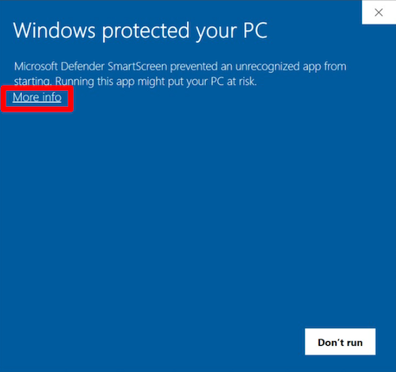

# Frequently Asked Questions

## Where do I find/download TuneFlow?

TuneFlow Web: [https://www.tuneflow.com](https://www.tuneflow.com)

You can also download TuneFlow Desktop from the homepage.

## I cannot open TuneFlow/page is too slow to open/desktop version hangs at startup.

There are two potential problems:

- Browser compatibilities (Web)

You can try to open TuneFlow web version from Google Chrome or macOS Safari.

- Network issues

TuneFlow doesn't have mainland China servers yet, the estimated time for it is end of 2022.

If you encountered such issues at the moment, please try to close the app and reopen. And if the problem persists, try restarting the system.

## Trouble with installation

### Windows Defender doesn't allow me to install or run TuneFlow

If you see a warning like shown below when installing TuneFlow, click "More info" and choose "Run anyway".

The reason you see this is because we are renewing code signing certificate and Windows Defender need many more samples to build trust for the new certificate.

## Can I use songs generated by TuneFlow commercially? Do I need to include attribution?

Please see [Copyright and Licenses](https://help.tuneflow.com/en/terms-of-service/license.html) for more information.

## I found a suspicious copy that's generated by TuneFlow

Our AI models train on a large dataset of existing songs. Although we have taken advanced measures to ensure the generated pieces are original, there are inevitably some pieces that we may fail to catch. This is, as we know, a general issue for the entire generative AI community.

If you discovered suspicious songs that are similar to existing copyrighted songs, please use the `Report a Song Problem` button under the help menu, or reach out to us directly.

## I cannot use VST2 on TuneFlow Desktop

Steinberg （Developer of VST2）has announced [the discontinuation of VST2](https://helpcenter.steinberg.de/hc/en-us/articles/4409561018258-VST-2-Discontinued#:~:text=The%20discontinuation%20of%20VST%202,to%20offer%20VST%202%20compatibility.) a while back. We are reaching out to them to aquire a special license, and we'll follow up if there is any progress.

## macOS plugin scan stuck at `DLSMusicDevice`

It might be caused by having other DAWs running at the same time. Try closing them and try again.

## Where can I provide feedback to you?

Feel free to send an email to our [inbox](mailto:contact@info.tuneflow.com).
