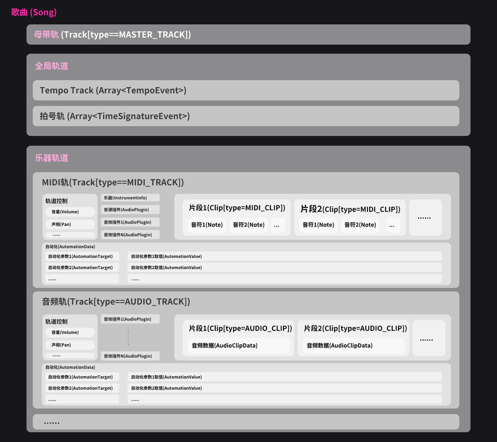

# 数据模型

本段建议配合对应的[代码源文件](https://github.com/andantei/tuneflow/tree/master/src/models)一起阅读。主要的数据类型如下：

## 歌曲 (`class Song`)

歌曲`class Song`，文件 [src/models/song.ts](https://github.com/andantei/tuneflow/blob/master/src/models/song.ts)。它包含了整首曲目的全部数据，里面主要包含：

**全局信息**

- 分辨率 PPQ
  - PPQ(Pulses-per-Quater Note) 指播放时每个四分音符对应多少个`tick`。
- 节奏轨（`Array<TempoEvent>`)
  - 包含了所有的节奏变化。
- 拍号轨 (`Array<TimeSignatureEvent>`)
  - 包含了所有的拍号变化。

**母带轨（`masterTrack: Track`）**

用于控制整体的音量，声相，音效等。

**乐器轨（`Array<Track>`)**

包含了所有的 MIDI 轨道和音频轨道。

## 轨道 (`class Track`)

文件 [src/models/track.ts](https://github.com/andantei/tuneflow/blob/master/src/models/track.ts)。轨道有不同的类型，目前支持的轨道包括 MIDI 轨道，音频轨道和母带轨道。

**通用轨道数据** 可以发声的轨道（MIDI，音频，母带）都包含以下数据：

- 音量（`volume`)：以音量推子(Fader)的位置 (0 - 1)为单位。
- 声相(`pan`)：表示该轨道的音频有多少分别发送到左右声道，取值为([-64, 63])。
- 静音(`muted`)：表示该轨道是否被静音
- 独奏(`solo`)：表示是否只演奏该轨道
- 自动化(`automation`): 里面包含所有设置的自动化参数和每个参数对应的自动化序列值。
- 音频插件(`audioPlugins`): 负责处理音效的 VST/AU 插件。
- 片段(`clips`)：MIDI 轨道和音频轨道都可以包含片段，片段可以承载一段音符或音频。

**MIDI 轨道**

MIDI 轨道主要承载音符数据，它的类型(`type`)为`TrackType.MIDI_TRACK`。

其中包含乐器信息(`insturment: InstrumentInfo`)，音源 VST/AU 插件数据(samplerPlugin: AudioPlugin)，和 MIDI 片段`clips: Array<Clip[type==MIDI_CLIP]`。

当用户使用`简易`播放引擎时，DAW 将会使用`instrument`指定的乐器类型来将音符数据转换为音频；当用户使用`VST`播放引擎时，DAW 将会使用`samplerPlugin`指定的 VST/AU 插件来做转换。

MIDI 轨道存储在`Song`的`tracks`当中，它们只负责处理类型为`ClipType.MIDI_CLIP`的片段。

**音频轨道**

音频轨道主要承载音频文件，它的类型(`type`)为`TrackType.AUDIO_TRACK`。

存储在`Song`的`tracks`当中，它们只负责处理类型为`ClipType.AUDIO_CLIP`的片段。

**母带轨道**

这个轨道不包含片段，它的主要功能是提供全局的调节功能，比如它可以调节全局的音量，声相，或者可以添加全局的音效插件等。它并不在`Song`的`tracks`中，而是`Song`中一个单独的`masterTrack`属性。它的类型(`type`)为`TrackType.MASTER_TRACK`。

<!-- prettier-ignore-start -->
::: tip
概念上节奏和拍号都被称为轨道，但如前所述，他们只是作为相应数据的数组存储在`Song`中，并不属于`Track`类型。
:::
<!-- prettier-ignore-end -->

## 片段 (`class Clip`)

文件 [src/models/clip.ts](https://github.com/andantei/tuneflow/blob/master/src/models/clip.ts)。片段存在于`Track`的`clips`列表中，是音符和音频的实际载体。用户可以调节片段的起始和结束位置，也可以将片段在不同的轨道中移动。

**MIDI 片段**

MIDI 片段的类型(`type`)为`ClipType.MIDI_CLIP`，它只在 MIDI 轨道中有效。它主要包含`notes: Array<Note>`列表。

**音频片段**

音频片段的类型(`type`)为`ClipType.AUDIO_CLIP`，它只在音频轨道中有效。它主要包括指向一个音频文件的音频数据：`audioClipData: AudioClipData`。

## 音频插件 (`class AudioPlugin`)

文件[src/models/audio_plugin.ts](https://github.com/andantei/tuneflow/blob/master/src/models/audio_plugin.ts)。音频插件指传统意义上用于音频处理的 VST/AU 等插件。它们可以是音源插件(Synth/Sampler)，用于将音符转换为音频；也可以是音效插件(Effects)，用于为音频添加各种各样的效果。

MIDI 轨道和音频轨道都包含一个`audioPlugins: Array<AudioPlugin>`的列表，用于存储音效插件信息。MIDI 轨道还包含一个`samplerPlugin: AudioPlugin`的属性，用于存储音源插件信息。

## 自动化 (`class AutomationData`)

文件[src/models/automation.ts](https://github.com/andantei/tuneflow/blob/master/src/models/automation.ts)。音乐的魅力很大程度来源于变化，比如，某一些段落中我们需要某个乐器的声音做主导，而另一些段落中我们需要这个乐器变小声，这个时候我们就可以将轨道的音量变成一个自动化参数，从而随着时间进行变化，这个过程就是自动化(Automation)。因为我们添加的数据点可以连成一条变化的曲线，通常我们也把这个过程叫做画包络线。

自动化储存在`Track`的`automation: AutomationData`属性中。`AutomationData`由两部分组成：自动化属性(`AutomationTarget`)和自动化取值(`AutomationValue`)。前者以`AutomationTarget`列表`targets: AutomationTarget[]`的形式存储在`AutomationData`中，它列出了轨道中所有拥有自动化信息的属性。后者以的形式`targetValues: { [tfAutomationTargetId: string]: AutomationValue}`存储在`AutomationData`中，它包含了每一个`AutomationTarget`对应的自动化点的数据。

继续阅读：[插件系统如何运转](./how-we-run-plugins.md)以及[如何创建你的第一个插件](./create-your-first-plugin.md)
