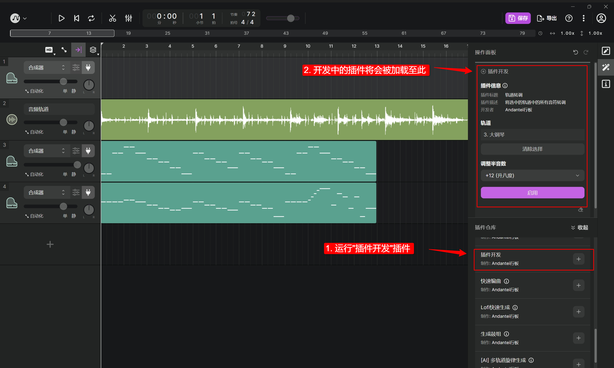

# 在本地运行和调试你的插件

要在本地开发 TuneFlow 插件，我们需要启动一个本地调试服务器，它负责模拟生产环境，并且在本地直接与 TuneFlow 桌面版通信。为此，我们需要首先安装 `tuneflow-devkit-py`。

```bash
pip install tuneflow-devkit-py
```

<!-- prettier-ignore-start -->
::: tip
大部分情况下，你只需要安装 `tuneflow-devkit-py` 就足够调试和部署你的插件了。如果你需要用到更新版本的 `tuneflow-py` 中的特性，你可以在你的`requirements.txt` 中手动指定 `tuneflow-py` 的版本。但需要注意的是你可能需要确保 `tuneflow-py` 的版本与 `tuneflow-devkit-py` 兼容。你可以查看 `tuneflow-devkit-py` 包中的 `requirements.txt` 是否与你的 `tuneflow-py` 版本是同一个小版本(minor)。
:::
<!-- prettier-ignore-end -->

## 用 `tuneflow-devkit-py` 运行本地插件

当我们编写好插件后，需要启动上述的调试服务器来与 TuneFlow 桌面版通信。为此我们需要创建一个 `debug.py` 文件，它的内容只需几行(参考 [debug.py](https://github.com/tuneflow/tuneflow-py-demos/blob/main/src/debug.py)):

```python
# debug.py

from your_plugin_path import YourPlugin
from tuneflow_devkit import Debugger

if __name__ == "__main__":
    Debugger(plugin_class=YourPlugin, bundle_file_path="your bundle.json file path").start()
```

接下来，用以下指令即可启动我们的调试服务器:

```bash
python debug.py
```

接下来，启动 TuneFlow Desktop。并在 TuneFlow 插件库中安装我们的插件。



你将会看到我们开发中的 Python 插件以调试模式加载到了 TuneFlow Desktop 中。

根据你在`bundle.json`设置中提供的`triggers`，你可以在对应的右键菜单中运行你的插件。

## 样例展示

学习插件开发最好的方式就是阅读现有的例子。[tuneflow-py-demos](https://github.com/tuneflow/tuneflow-py-demos) 包含了大量的示例代码。

## 调试插件

在开发插件时，我们需要在执行插件时设置断点并监视变量。不同的 IDE 设置方式不同，下面我们将以 VSCode 为例。

首先，在你的工作目录下创建一个 `.vscode/launch.json` 的调试配置文件，然后如下所示进行配置，注意将 PYTHONPATH 设置为你项目所需的 PYTHONPATH：

```json
{
  "version": "0.2.0",
  "configurations": [
    {
      "name": "Python: Current File",
      "type": "python",
      "request": "launch",
      "program": "${file}",
      "console": "integratedTerminal",
      "justMyCode": true,
      "env": {
        "PYTHONPATH": "<your python path here>"
      }
    }
  ]
}
```

接下来，在我们的插件相关文件中，我们需要通过单击行号旁边的空白处来设置断点：


最后，打开调试入口文件 `debug.py`。在 VSCode 的调试面板中，将调试目标设置为 `Python: Current File` 并单击启动按钮。


现在，当你运行插件时，你将能够在断点处暂停执行并查看调用栈和变量信息。


<!-- prettier-ignore-start -->
::: tip
关于如何在 VSCode 中调试 Python 代码的更多信息，请参见 [https://code.visualstudio.com/docs/python/debugging](https://code.visualstudio.com/docs/python/debugging)
:::
<!-- prettier-ignore-end -->

## 在调试插件时进行代码修改

当你更改插件代码后，你可能需要退出 Devkit 并重新启动它。**请注意，当你重新启动开发套件后，你可能也需要在 TuneFlow 中重新安装你的插件**，这样下次运行你的插件时，它才可以正确初始化。

## 下一步

现在我们有了一个可以正常跑起来的插件！是时候把它部署到服务器上，让每个人都可以使用它了。继续阅读 [部署你的插件](./deploy-plugin-python.md)
