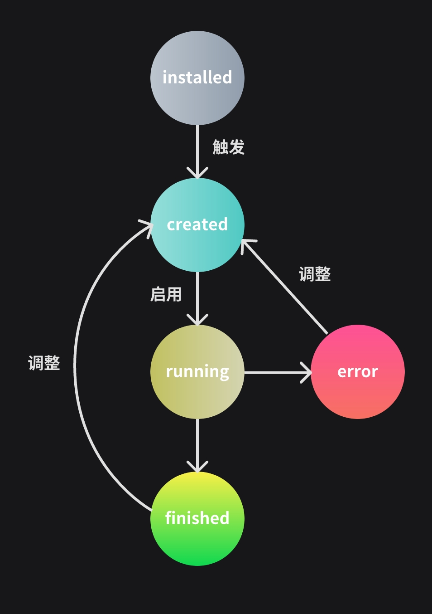

# Python 插件开发入门

TuneFlow 插件系统的核心思想是：开发者只需要关心数据模型，而不需要关心具体实现。

## 插件生命周期

TuneFlow 插件的唯一目标是修改歌曲数据，而 DAW 将会获取修改后的结果并自动应用所有改动。如图所示：


插件的生命周期包括 5 个状态：**installed**、**created**、**running**、**finished**、**error**。

<p style="text-align: center">
  
</p>

- `installed` 插件已被安装到插件仓库中，但尚未被用户触发时的状态。

- `created` 这是用户从插件仓库或右键菜单触发插件时的状态。此时，插件被添加到编辑面板，但插件需要的参数可能还没有被全部提供。

- `running` 这是当用户点击插件控制面板上的**启用**按钮（或者如果所有参数在创建时已经被提供，并且该插件没有**启用**按钮），并开始运行插件时的状态。

- `finished` 这是在插件修改了歌曲快照并且 DAW 基于修改后的结果创建了一个新快照之后的状态。插件随后被销毁并释放资源。

- `error` 这是插件在`running`状态遇到错误时会转移至的状态。

### 运行流程

一般的插件运行流程为 `installed` -> `created` -> `running` -> `finished`。但有两个例外：

1. 如果插件在`running`状态遇到错误，插件状态条会变为红色，插件会转入`error`状态。

2. 如果用户选择在`finished`或`error`状态调整插件，则插件会返回到`created`状态。

## 定义插件

插件开发的基本单位是插件包(Plugin Bundle)。一个 Python 插件包由两个部分组成：插件包文件和插件文件。

### 插件包文件 (`bundle.json`)

插件包文件通常命名为`bundle.json`，其中包含此插件包中所有插件的信息。这里的信息将在用户加载插件代码之前显示给用户。

一个示例的`bundle.json`文件如下所示：

```json
{
  "plugins": [
    ......,
    {
      "providerId": "my-provider-id",
      "providerDisplayName": "我的开发者名称",
      "pluginId": "my-plugin-id",
      "pluginDisplayName": "我的插件名称",
      "version": "1.0.0",
      "minRequiredDesktopVersion": "1.8.3",
      "options": {
        "allowReset": false
      }
    },
    ......
  ]
}

```

### 插件代码 (`plugin.py`)

在插件的根目录下，我们需要创建一个`plugin.py`文件，用于定义插件代码。你也可以将其他源代码放在同一目录下。当 TuneFlow 运行插件时，它会将插件的根目录添加到 `PYTHONPATH`中。

一个最简单的 Python 插件代码如下所示:

```python
from tuneflow_py import TuneflowPlugin, Song, ParamDescriptor


class HelloWorld(TuneflowPlugin):
    @staticmethod
    def provider_id():
        return "andantei"

    @staticmethod
    def plugin_id():
        return "hello-world"

    @staticmethod
    def params(song: Song) -> dict[str, ParamDescriptor]:
        return {}

    @staticmethod
    def run(song: Song, params: dict[str, Any]):
        print("Hello World!")

```

<!-- prettier-ignore-start -->
::: tip
这里的所有方法都是静态方法。这是有意为之的：整个插件应该是无状态的(stateless)，一个插件执行的结果仅由输入决定，而不受插件本身任何内部状态的影响。
:::
<!-- prettier-ignore-end -->

在编写插件时，我们的主要关注点是`params`和`run`方法。

#### `params`

当用户触发插件时（即`installed` -> `created`），将调用此方法。你应该在此返回你希望从用户或 DAW 获取的输入参数。DAW 将用你返回的配置生成你的插件 UI。

额外地，你可以使用 `song` 来获取项目当前快照的信息，以便定制你的参数。例如，如果你有一个适用于不同拍号的预设列表，你可以使用`song`来读取当前歌曲的拍号，并在返回参数列表时过滤掉不适用于歌曲的选项。

#### `run`

当用户通过点击 **启用** 按钮实际运行插件时 (即 `created` -> `running`)，DAW 将调用此方法。

这里是你实现主要逻辑的地方。该方法接收当前歌曲的快照 (`song: Song`)，以及根据你提供的参数列表，从用户或 DAW 那里收集到的参数值 (`params`)。

## 下一步

现在我们已经了解了插件的基本生命周期和结构，让我们实际开始构建一个插件吧！继续阅读 [在本地运行和调试您的插件](./devkit-python.md)
