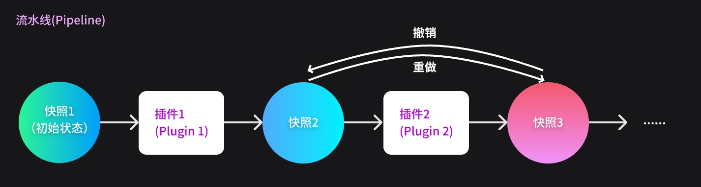

# 插件系统是如何运作的？

在开始开发前，我们有必要先了解一下插件系统的运行机制。

TuneFlow 的绝大部分编辑操作都是由插件来完成的，你可以把插件系统看成是编辑器的执行引擎。

每一次用户启用插件时，DAW 会调用插件的`init`方法进行初始化。插件运行时，DAW会将当前的歌曲数据制作一个快照(Snapshot)，并发送给插件的`run`方法进行处理。这个快照包括了整个工程的绝大部分可编辑的数据，例如歌曲本身的节奏，拍号；每个轨道的乐器，音符，音频内容，自动化，音频插件等。

插件的`run`方法接收到的歌曲快照是一个`Song`实例，我们可以在插件中任意访问和修改`Song`实例的内容。当`run`执行完后，DAW 会读取由插件修改完成的`Song`，并将插件做出的修改一一应用到界面和音频引擎中。

当用户进行撤销或者重做时，插件便不再参与，而是由 DAW 直接切换不同的快照。

作为开发者，我们需要关心的就是如何实现`init`和`run`方法。

继续阅读：[数据模型](./data-models.md)以及[如何创建你的第一个插件](./create-your-first-plugin.md)
