# 主编辑界面简介

打开由你创建的曲目后，你将会进入主编辑界面。

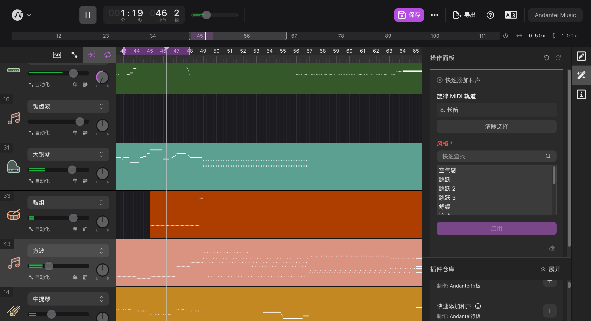

以下是各个编辑区的介绍：

## 主菜单

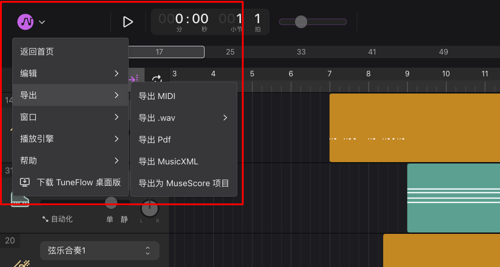

主菜单中包括大部分常用的菜单项。你可以在这里调整播放器设置，导出当前曲目等。

## 播放控制区 & 播放信息

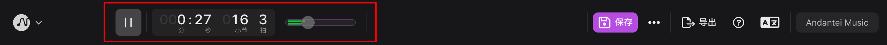

播放控制区主要包括播放/暂停控制，总音量 (Master Volume) 控制等。在编辑模式下这一控制区还包括当前的时间信息，包括当前播放头所在的时间，小节和拍数等。

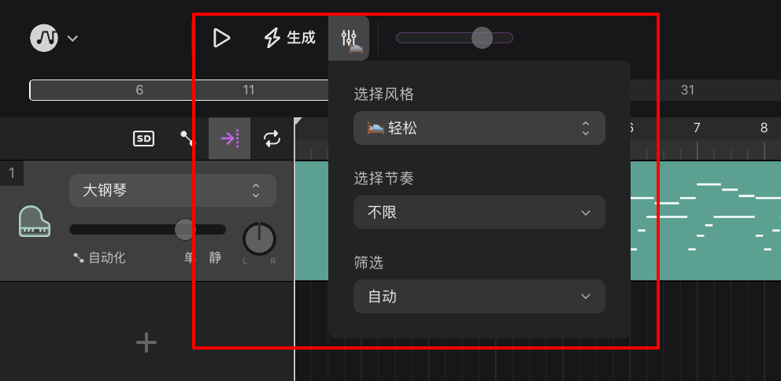

在生成模式下，时间信息会被替换为生成控制。你可以在这里调整生成参数并快速重新生成新的基础旋律。

## 全局功能

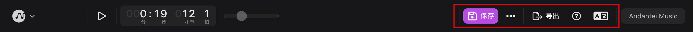

全局功能包括常见的针对曲目本身的操作，包括保存，导出，发布等。以及编辑器的常见操作，包括查看帮助和切换使用语言等。

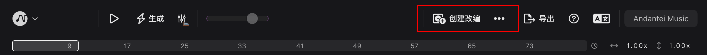

在生成模式下，歌曲必须创建改编后才能保存修改，因此歌曲相关功能被替换为创建改编和分享等。

## 用户菜单

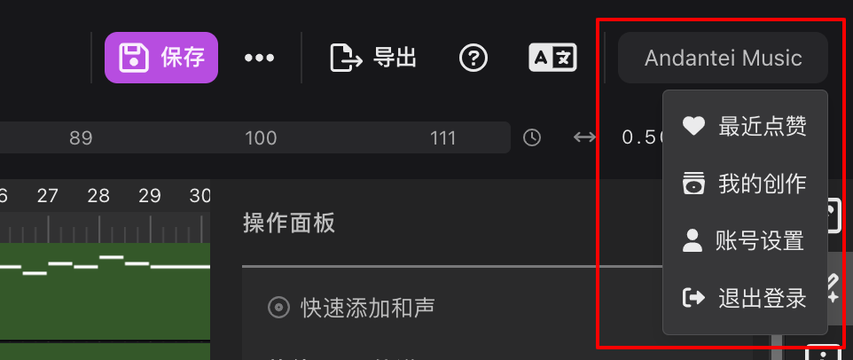

用户菜单可以帮助你快速浏览近期点赞或编辑过的曲目。你也可以在这里修改你的账号设置。

## 时间轴与播放头

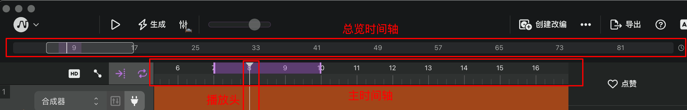

在主编辑界面中包括一个总览时间轴（上方圈出），和一个主时间轴（下方圈出）。你可以通过总览时间轴在歌曲的不同段落之间快速移动。

主时间轴包括上下两个部分，上半部分显示了小节的数字，下半部分显示了小节（亮实线）和拍子（暗实线）的刻度。

在主时间轴上方拖动，即可选中某一区域进行循环播放。

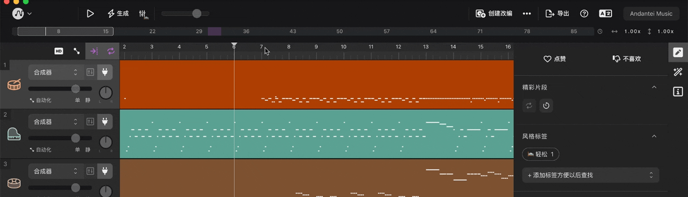

主时间轴中包括播放头，它指示了当前编辑器的播放位置。你可以通过拖动播放头本身，或者在主时间轴刻度部分进行拖动来移动播放头。

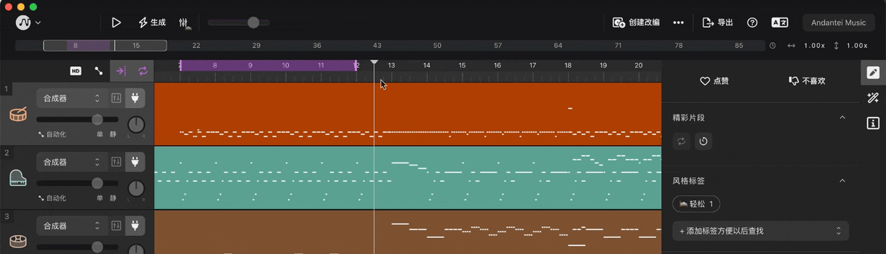

## 全局轨道控制

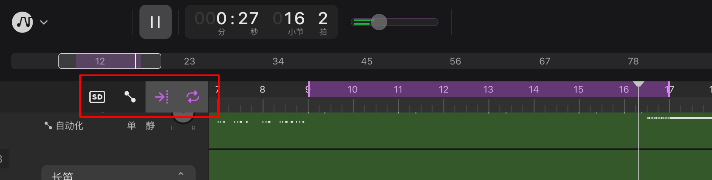

这一区域包括大部分与轨道编辑和播放相关的全局控制。

### 切换播放引擎

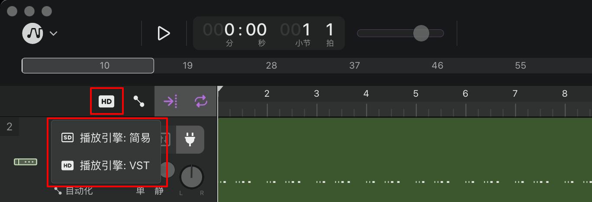

你可以通过它切换不同的引擎：

- 「简易」播放引擎可以在网页端或桌面端使用，你不需要安装任何软件即可使用。但缺点是音色需要实时加载，切换乐器或是加载歌曲的时候需要较长的等待时间。
- 「VST」播放引擎支持桌面版。进入桌面版歌曲编辑界面后，点击切换播放引擎按钮选择「VST」即可。「VST」引擎支持`VST3`或`Audio Unit`音频插件。你可以挂载你喜欢的 VST 插件来更好地拓展轨道的音色和演奏手法。

### 切换自动化编辑

当自动化编辑模式开启时，点击此按钮即可退出自动化编辑模式。

### 跟随播放头

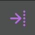

开始播放时，编辑区域将会自动翻页以保持当前正在播放的区域可见。点击此按钮可以暂时停用或启用此功能。

### 启用/暂停循环播放

当时间轴有循环区域选中时，TuneFlow 将会循环播放高亮选中的部分。点击此按钮可以暂时停用或启用循环播放区域。

## 分轨

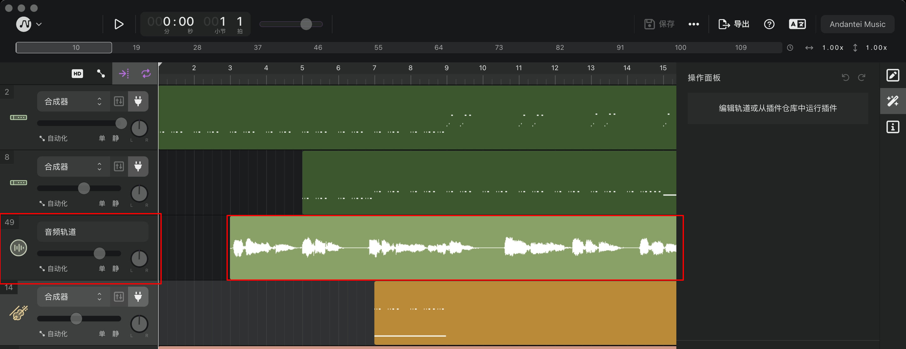

主编辑区由曲目中所有的分轨组成。每一条分轨包括两个部分：轨道控制（左）和内容片段（右）。

### 轨道控制

轨道控制主要包括对该分轨的设置和音量，声相，静音，独奏等控制。

对于 MIDI 轨道，你可以通过乐器选择器或 VST 选择器（桌面版）切换该轨道的音色。

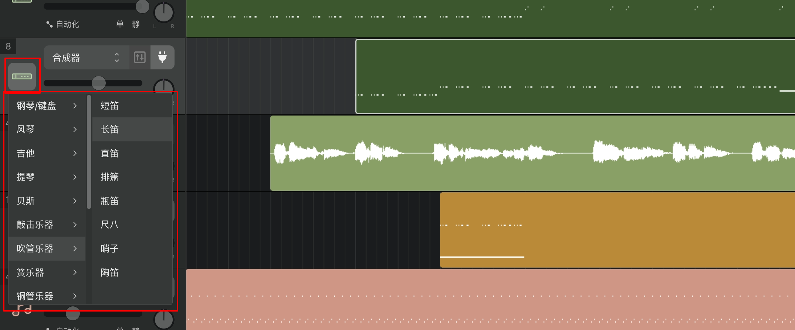

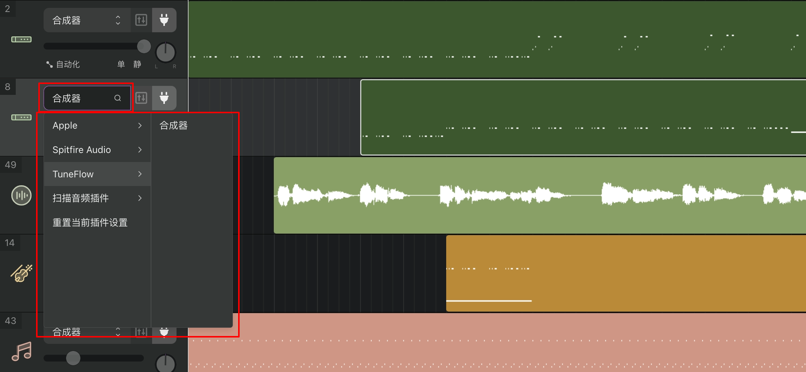

<!-- prettier-ignore-start -->
::: tip
使用「VST」播放引擎时，MIDI 轨道的声音将完全由音源插件合成。除了使用 TuneFlow 自带的合成器插件外，乐器选择器只作为参考而不会影响轨道实际的音色。
:::
<!-- prettier-ignore-end -->

## 编辑面板

主工作区的右侧是所有的编辑面板。

### 轨道编辑面板

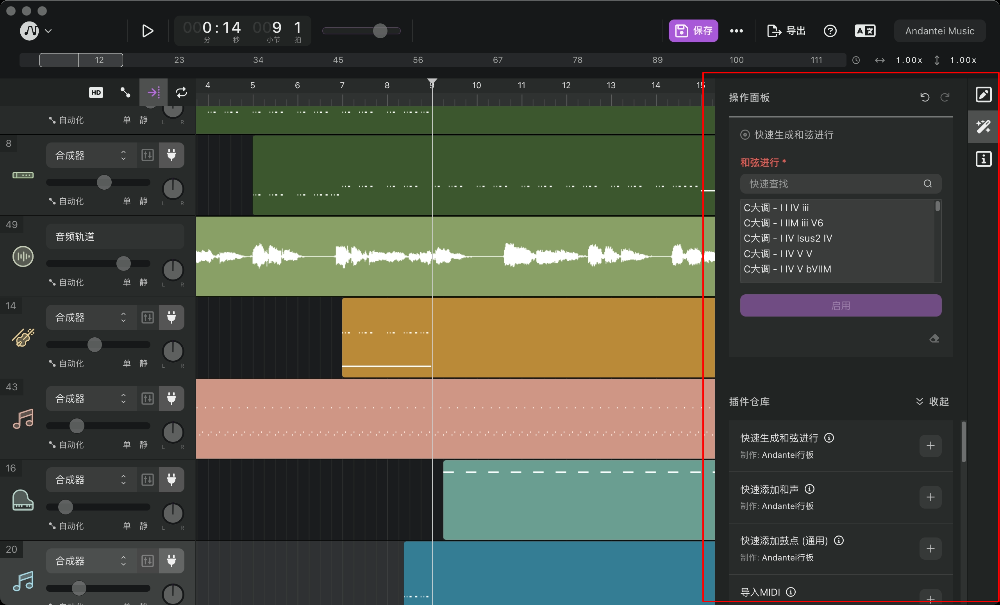

面板的右上方是「撤销」和「重做」按钮。

当前正在进行或已完成的编辑操作详情会以卡片的形式展示在面板上半部分。部分操作提供了可调节的参数，你可以直接在操作卡片上进行编辑。操作卡片的上方有一根指示条，指示条的颜色代表了插件的状态：绿色代表已经执行完毕；红色代表遇到了问题无法执行；闪烁的黄色进度条代表该操作正在处理中。

面板下方是插件仓库，也是 TuneFlow 的编辑功能中最核心的部分。你可以在这里找到许多常见的高级编辑功能，比如快速添加和声，自动添加风格化的鼓点等。你可以把它看成是一个不断成长的插件市场，TuneFlow 和第三方开发者们会源源不断地开发更多实用的作曲/编曲插件，来帮助你快速地完成一些复杂的需求。

在插件仓库中找到需要的插件后，点击右侧的添加按钮即可运行该插件。

### 基础信息面板

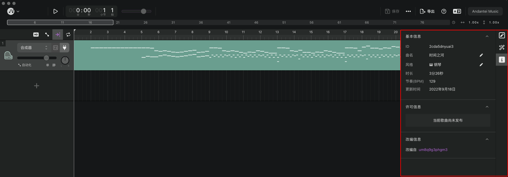

该面板包括了歌曲的基础信息。如果你是歌曲的创建者，则可以在此编辑相应的信息。

### 信息标注面板

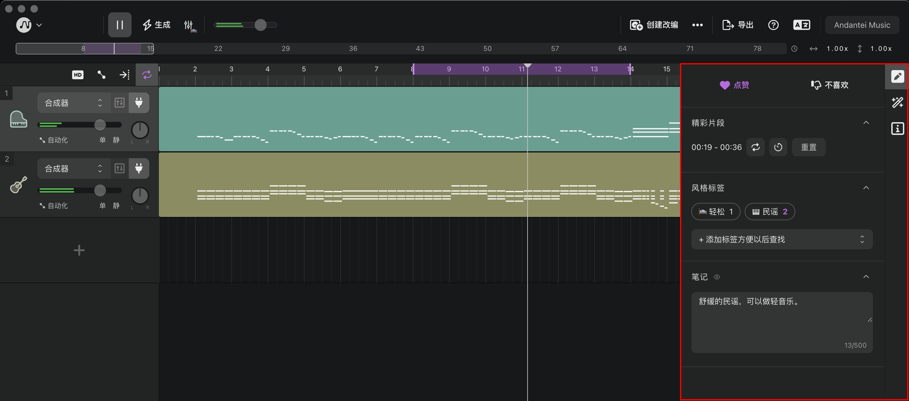

当歌曲已发布时，这个面板会展示所有用户对已这首歌曲的标注信息。包括推荐风格，推荐循环片段等。你也可以在这里点赞并添加你对这首歌曲的注释，方便以后查找。

<!-- prettier-ignore-start -->
::: tip
点赞后，你可以在右上角的用户菜单中的「最近点赞」中快速找到这首歌。
:::
<!-- prettier-ignore-end -->
