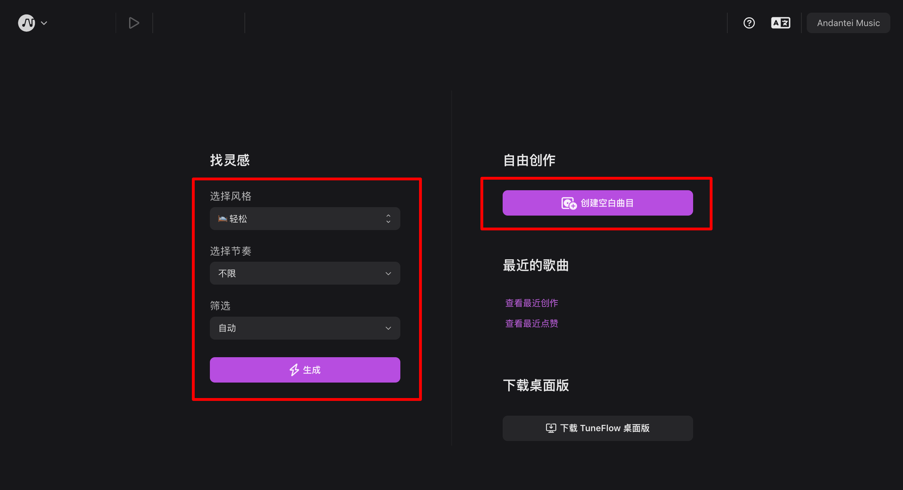
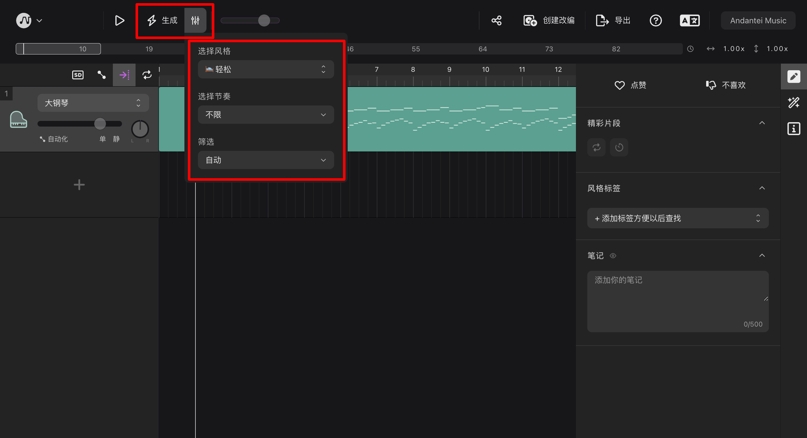
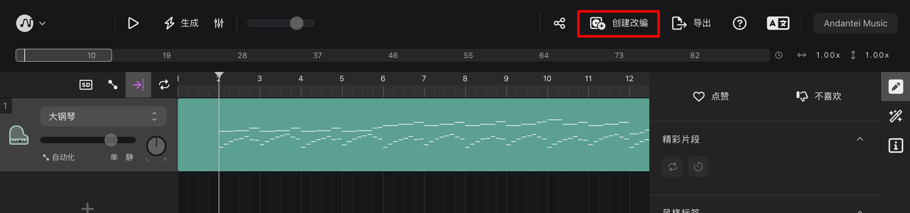
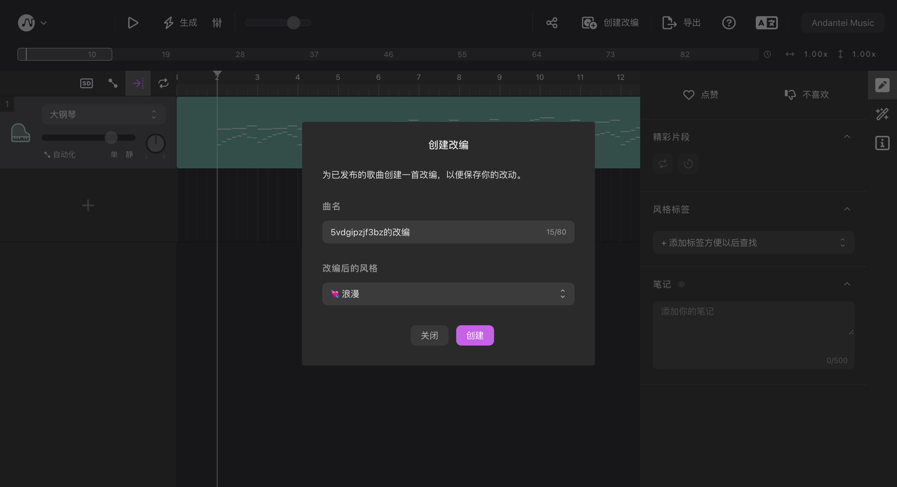

# 创建你的第一首曲子

进入首页，你会首先看到两种类型的入口：「找灵感」和「自由创作」。接下来我们会详细介绍两种创作模式的使用方法。

## 找灵感

在该模式下，你可以用 AI 引擎快速生成底稿，在找到喜欢的底稿后直接下载或者在 TuneFlow 中进行改编。首先在左侧「找灵感」一栏中选择你需要的生成参数：

### 风格与筛选

「风格」参数指定了 AI 生成模型在生成歌曲时采用的预设参数。每一首歌曲生成出来后将会永久保存在 TuneFlow 上，其他用户也可能在今后继续生成这首歌曲，并且所有浏览到这首歌曲的用户都可以为它打上自己认同的风格标签。

<!-- prettier-ignore-start -->
::: tip
风格参数是一个软性的参数，它会影响模型的生成走向，但实际产出的风格并不一定完全符合预设。要强制限定产出的风格，参见「筛选」参数。
:::
<!-- prettier-ignore-end -->

「筛选」参数指定了实际产出的歌曲风格。当设置为「只看未筛选过」时，只有其他用户没有做过任何风格标记的歌曲可以被生成出来，通常生成的结果将是一首全新的曲目，或是以前被生成过但尚未有用户标记的曲目。当设置为「只看其他用户筛选过」时，则只有已经被生成过，并且你指定的风格与其他用户已经标记过的风格相符时才会生成。如果设置为「自动」，则 TuneFlow 会智能地从两种选项中选择最适合的一种。

### 节奏

节奏指定了生成歌曲在听感上的快慢，或者激烈程度。根据你的需求选择适合你的选项。

### 更改生成参数

很多时候我们都对第一次生成的曲子不够满意。这个时候我们可以在编辑器中快速重新生成。  在生成后的歌曲编辑界面，点击上方菜单栏中「生成」按钮旁边的设置图标。在下拉菜单中重新选择生成参数。选择完成后，点击「生成」按钮即可重新生成。

### 下载或创建改编

找到合适的基础旋律后，你可以选择下载该旋律到其他的 DAW 中继续编辑，或者直接在 TuneFlow 中进行改编。

#### 下载

 点击右上角「导出」按钮。在下拉菜单中选择需要的导出格式。

#### 创建改编

TuneFlow 自带了大量智能创作插件帮助你快速为曲子搭配鼓点，和声等。你只需要为喜欢的基础旋律创建改编，即可直接快速使用这些强大的插件。  首先点击菜单栏中的「创建改编」按钮。  在出现的改编对话框中填写改编后的曲名和风格，并点击「创建」即可。

## 自由创作

在自由创作模式下，你将会从空白歌曲开始创作。你可以直接对轨道进行编辑，或者使用插件仓库中的插件进行快速编曲。

## 编辑你的第一首曲子

创建好改编或者新建了曲子后，我们就可以开始利用TuneFlow强大的编辑功能进行编辑了。继续阅读[「编曲和制作」](/help/zh/editing-tracks/)，你可以了解到如何使用TuneFlow的智能插件对曲子进行快速改编；挂载VST进行预览以及快速导出分轨等。